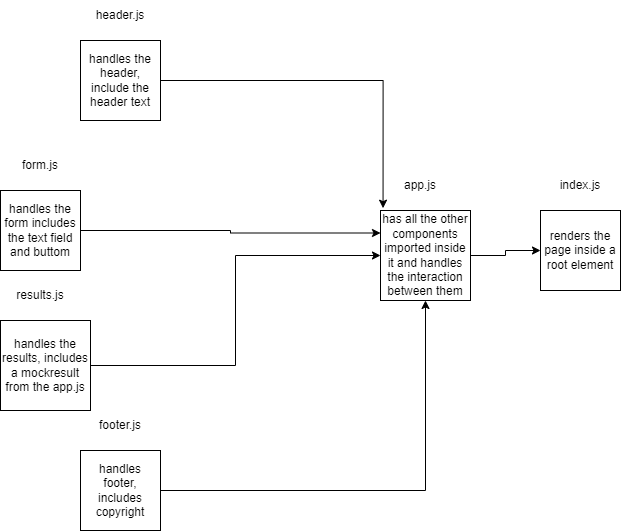

# Project: RESTy

## [live URL]()

The RESTy application, created in React, is the first of a four-part development. Our goal in this initial step is to set up the application's basic infrastructure, with the intention of adding more functionality as we go. This first build establishes the file structure, allowing us to grow this application in a scalable manner over time.

### Setup
```
git clone 
cd resty
npm install
```

### initialize
```
npm start
```

#### UML

